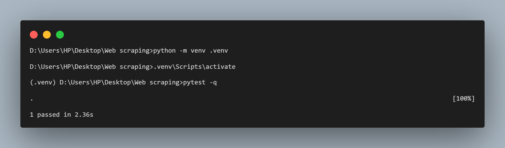

# Web Scraper — Work Sample
A compact, production-minded Python web-scraper designed as a portfolio/work-sample project.

### 1. Unzip it

Clone the repo or just download the zip file and extract Web-Scraper.zip somewhere neat, then open a terminal in that folder:
```bash
cd web-scraper-work-sample
```

Where the src/, requirements.txt, Dockerfile, etc. exist.

### 2. Create and activate a virtual environment

Keeps your system Python clean (trust me, it’ll thank you later):
```
python -m venv .venv
```

Activate it:

macOS/Linux:
```bash
source .venv/bin/activate
```

Windows:
```bash
.venv\Scripts\activate
```

### 3. Install dependencies
```bash
pip install -r requirements.txt
```

You’ll see `aiohttp`, `beautifulsoup4`, `typer`, `pandas`, etc., install.

### 4. Run the scraper

Let’s fetch something harmless, like example.com:
```bash
python -m webscraper.cli fetch https://example.com --out results.json
```

You should see output like:
```pgsql
Saved 1 results to results.json
```

Then open the generated file:
```bash
cat results.json
```

Output will be something like:

```json
[
  {
    "title": "Example Domain",
    "links": [
      "https://iana.org/domains/example"
    ],
    "url": "https://example.com"
  }
]
```

You can also test it using `pytest -q`



If you get this then, Shazam!! It works!!!🤩 
